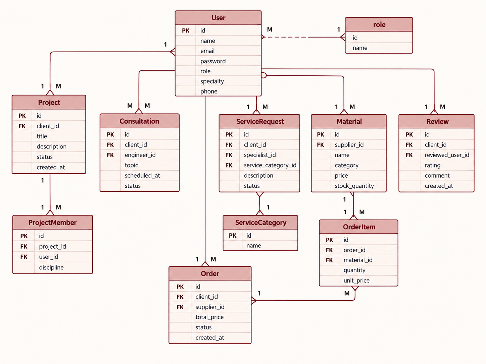

# BUNYAN


BUNYAN is an engineering and property services platform that brings clients, engineers, specialists, and building-material suppliers together in one place.

A client can create an engineering project, request a consultation with an engineer, request smaller property services from specialists, browse building materials, place orders, and track the progress of their requests.

The back end was built using FastAPI and PostgreSQL and provides the API, authentication, authorization, database relationships, and role-based permissions used by the BUNYAN front end.

---

## Front-End Application

The BUNYAN front-end repository can be viewed here:

[BUNYAN Front-End](https://github.com/Mrymhussain/bunyan-front-end)

### Deployed Front-End

[BUNYAN Live Application](https://bunyan-front-end.onrender.com)

---

## Deployed Back-End

The deployed FastAPI back end can be viewed here:

[BUNYAN Back-End](https://bunyan-back-end.onrender.com)

---

## Back-End Repository

[BUNYAN Back-End Repository](https://github.com/Mrymhussain/bunyan-back-end)

---

## Main Roles

BUNYAN supports five user roles:

- Client
- Engineer
- Specialist
- Supplier
- Admin

Each role has different permissions and access to different parts of the system.

---

## User Stories

### Users

- As a user, I want to create an account so I can use the platform.
- As a user, I want to sign in securely.
- As a user, I want to sign out when I finish using the platform.
- As a user, I want to view and update my profile.
- As a user, I want to access features based on my role.

### Clients

- As a client, I want to create a project request.
- As a client, I want to view and update my project details.
- As a client, I want to follow the progress and status of my project.
- As a client, I want to see the engineers assigned to my project.
- As a client, I want to post and view updates in the Project Room.
- As a client, I want to request consultations with engineers.
- As a client, I want to request smaller services from specialists.
- As a client, I want to browse materials and place orders.
- As a client, I want to follow the status of my service requests and orders.
- As a client, I want to leave ratings and reviews for professionals.

### Engineers

- As an engineer, I want to view projects assigned to me.
- As an engineer, I want to post updates in the Project Room.
- As an engineer, I want to update project progress and status.
- As an engineer, I want to approve my assigned engineering discipline.
- As an engineer, I want to add an approval note for my discipline.
- As an engineer, I want to view and manage consultation requests assigned to me.
- As an engineer, I want to view feedback received from clients.

### Specialists

- As a specialist, I want to view service requests assigned to me.
- As a specialist, I want to accept a service request.
- As a specialist, I want to update the status of a service request.
- As a specialist, I want to view feedback received from clients.

### Suppliers

- As a supplier, I want to add building materials.
- As a supplier, I want to edit or delete my own materials.
- As a supplier, I want to view orders for my materials.
- As a supplier, I want to update the status of an order.

### Admin

- As an admin, I want to view projects across the platform.
- As an admin, I want to assign engineers to projects.
- As an admin, I want to remove engineers from projects.
- As an admin, I want to monitor project activity and Project Room updates.
- As an admin, I want to view consultations and service requests.
- As an admin, I want to view materials and orders.
- As an admin, I want to view reviews across the platform.
- As an admin, I want to remove reviews when necessary.

---

## Project Room

Each project includes a shared Project Room for the client, assigned engineers, and admin.

The Project Room includes:

- Engineering team members
- Engineer disciplines
- Shared project updates
- Project progress
- Project status
- Discipline approvals
- Approval notes
- Meeting details
- Meeting date and time
- Meeting link

The admin manages the engineering team, while assigned engineers can update project work and approve their own discipline.

---

## Database Models

The main database models are:

- User
- Project
- ProjectMember
- ProjectUpdate
- Consultation
- ServiceCategory
- ServiceRequest
- Material
- Order
- OrderItem
- Review

### ERD

The ERD shows the main database entities and relationships used in BUNYAN.



---

## Component Hierarchy

The component hierarchy shows how the main parts of the BUNYAN application are connected.


---

## Back-End API

All main API routes begin with:

```text
/api
```

### Authentication

| Method | Endpoint | Description |
| --- | --- | --- |
| POST | `/api/auth/signup` | Create an account |
| POST | `/api/auth/signin` | Sign in |
| GET | `/api/auth/me` | Get the current signed-in user |

### Users

| Method | Endpoint | Description |
| --- | --- | --- |
| GET | `/api/users` | Get users |
| GET | `/api/users/{user_id}` | Get one user |
| PUT | `/api/users/{user_id}` | Update a user |
| DELETE | `/api/users/{user_id}` | Delete a user |

### Projects

| Method | Endpoint | Description |
| --- | --- | --- |
| GET | `/api/projects` | Get accessible projects |
| POST | `/api/projects` | Create a project |
| GET | `/api/projects/{project_id}` | Get project details |
| PUT | `/api/projects/{project_id}` | Update a project |
| DELETE | `/api/projects/{project_id}` | Delete a project |

### Project Members

| Method | Endpoint | Description |
| --- | --- | --- |
| GET | `/api/projects/{project_id}/members` | Get project team |
| POST | `/api/projects/{project_id}/members` | Assign an engineer |
| DELETE | `/api/projects/{project_id}/members/{member_id}` | Remove a project member |

### Project Updates

Project updates are used by the Project Room so the client, assigned engineers, and admin can follow the project work and coordination.

### Consultations

| Method | Endpoint | Description |
| --- | --- | --- |
| GET | `/api/consultations` | Get consultations |
| POST | `/api/consultations` | Request a consultation |
| GET | `/api/consultations/{consultation_id}` | Get consultation details |
| PUT | `/api/consultations/{consultation_id}` | Update a consultation |
| DELETE | `/api/consultations/{consultation_id}` | Delete or cancel a consultation |

### Service Categories

| Method | Endpoint | Description |
| --- | --- | --- |
| GET | `/api/service-categories` | Get service categories |
| POST | `/api/service-categories` | Create a service category |
| PUT | `/api/service-categories/{category_id}` | Update a category |
| DELETE | `/api/service-categories/{category_id}` | Delete a category |

### Service Requests

| Method | Endpoint | Description |
| --- | --- | --- |
| GET | `/api/service-requests` | Get accessible service requests |
| POST | `/api/service-requests` | Create a service request |
| GET | `/api/service-requests/{request_id}` | Get request details |
| PUT | `/api/service-requests/{request_id}` | Update a request |
| DELETE | `/api/service-requests/{request_id}` | Delete a request |

### Materials

| Method | Endpoint | Description |
| --- | --- | --- |
| GET | `/api/materials` | Get materials |
| POST | `/api/materials` | Add a material |
| GET | `/api/materials/{material_id}` | Get material details |
| PUT | `/api/materials/{material_id}` | Update a material |
| DELETE | `/api/materials/{material_id}` | Delete a material |

### Orders

| Method | Endpoint | Description |
| --- | --- | --- |
| GET | `/api/orders` | Get accessible orders |
| POST | `/api/orders` | Create an order |
| GET | `/api/orders/{order_id}` | Get order details |
| PUT | `/api/orders/{order_id}` | Update order status |
| DELETE | `/api/orders/{order_id}` | Cancel an order |

### Reviews

| Method | Endpoint | Description |
| --- | --- | --- |
| GET | `/api/reviews` | Get accessible reviews |
| POST | `/api/reviews` | Create a review |
| DELETE | `/api/reviews/{review_id}` | Delete a review |

---


## Technologies Used

- Python
- FastAPI
- PostgreSQL
- SQLAlchemy
- Pydantic
- Alembic
- JWT Authentication
- REST API
- Pipenv
- Neon
- Render

---

## Deployment

The back end is deployed using Render.

The production PostgreSQL database is hosted using Neon.

### Back-End

https://bunyan-back-end.onrender.com

### Front-End

https://bunyan-front-end.onrender.com

---


## Attributions

Some project images were created using AI tools.